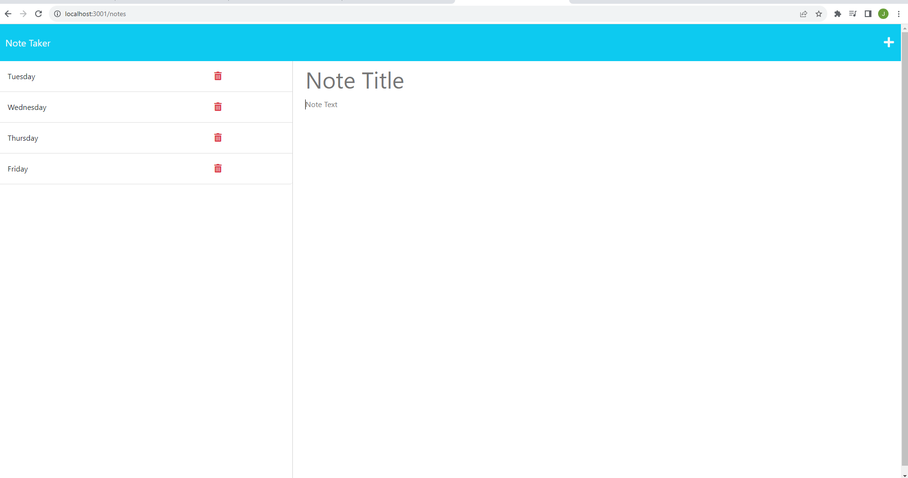

# Note Taker Starter Code

## Description
Note taker is applcation, where you can store several events that you have that day or coming up in couple days. Its helps you stay orgainze and manage your events or activites for that week.
## Deployed Application URL
https://javierburgara.github.io/Note-Taker/
## Screenshot

## Table of Contents
* [Description](#description)
* [Features](#features)
* [Languages & Dependencies](#languagesanddependencies)
* [How to Use This Application](#HowtoUseThisApplication)
* [Contributors](#contributors)
* [Testing](#testing)
* [Questions](#questions)
*[Contact-Me](#contact-me)
## Features

## Languages & Dependencies
N/A
## How to Use This Application:
HTML,JavaScript,Node,Jest
## Contributors
None
## Testing
 https://drive.google.com/file/d/1M9dGc1tLPRa7Cx6BAgiGW35bZ6wHLVZn/view
 video of application working and fulling functional

## Contact-Me
  * Name - JavierBurgara
  * Email - Javierburgara150@yahoo.com
  * Github - [JavierBurgara](https://github.com/JavierBurgara/)
## Questions
Please send your questions [here](mailto:Javierburgara150@yahoo.com?subject=[GitHub]%20Dev%20Connect) or visit [github/JavierBurgara](https://github.com/JavierBurgara).
